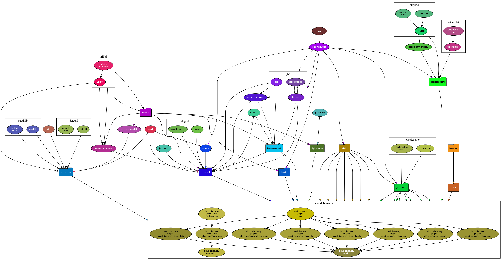
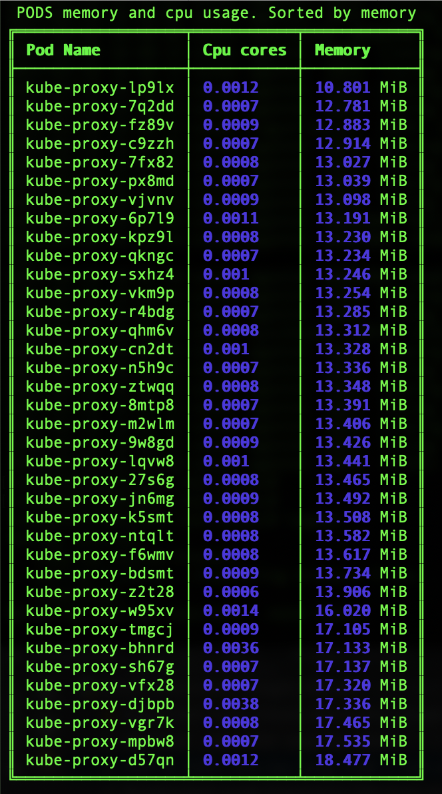

# Cloud discovery

Tool to discover nodes in cloud environments based on meta information like tags provided by the environment.

**Supported clouds**:

| Provider name | Plugin name                   | Description                                                  |      |
| ------------- | ----------------------------- | ------------------------------------------------------------ | ---- |
| AWS           | cloud_discovery_plugin        | Retrieving informtation about EC2 instances based on tag key |      |
| Azure         | cloud_discovery_plugin_azure  | Retrieving informtation about Azure virtual machines based on tag key |      |
| DigitalOcean  | cloud_discovery_plugin_do     | Retrieving informtation about DigitalOcean droplets based on tag key |      |
| GCE           | cloud_discovery_plugin_gce    | Retrieving informtation about Google cloud instances based on tag key |      |
| Kubernetes    | cloud_discovery_plugin_k8s    | Retrieving informtation about Kubernetes pods based on tag key |      |
| Linode        | cloud_discovery_plugin_linode | Retrieving informtation about Linodes based on tag key       |      |
| OpenStack     | cloud_discovery_plugin_os     | Retrieving informtation about OpeStack instances based on tag key or property key |      |
|               |                               |                                                              |      |
|               |                               |                                                              |      |

Default cloud at this moment AWS.

## Dependencies graph



## Architecture

Cloud discovery based on [Groundwork](https://groundwork.readthedocs.io/en/latest/).

Groundwork is a Python based microframework for highly reusable applications and their components.
Its functionality is based on exchangeable, well-documented and well-tested plugins and patterns.

**Workflow**:

User run command `cloud_discovery`, application checking  input parameters and if input parameters is not presented, shows help.

If input parameter in list, checking checking option which required and output format. If output format doesn't present, application use default output format(plain) . If all parameters and options in place, application try connect to selected cloud and get information about vm/instance/pod. Application return information about requested data or exit with error

## Instalation

From GitHub

```shell
python -m pip install git+https://github.com/pyToshka/cloud-discovery.git
```

Local installation

``` shell
git clone git@github.com:pyToshka/cloud-discovery.git
cd pyTerrafile
pip install .
```

## Usage

### General usage:

```bash
cloud_discovery
Usage: cloud_discovery [OPTIONS] COMMAND [ARGS]...

Options:
  --help  Show this message and exit.

Commands:
  aws    Find AWS instances by tag key
  azure  Find Azure vms by tag key
  do     Find Digitalocean droplets info by tag key
  gce    Find GCE vms by tag key
  k8s    Find Kubernetes pods by tag key
  li     Find Linodes info by tag key
  os     Find OpenStack instance info by tag key
```

#### General configuration:

Almost all providers following the same configuration strategy. As general strategy was choosed system environments for many reasons. Below providers specific usage and configuration.

### Provider specific usage

#### AWS

There are two way for configuration:

- Use ` ~/.aws/config` file
- System variables

For system variables make sure you exported

`AWS_ACCESS_KEY_ID` - The access key for your AWS account.
`AWS_SECRET_ACCESS_KEY` - The secret key for your AWS account.
`AWS_DEFAULT_REGION` - The default AWS Region to use, for example, us-west-1 or us-west-2.

or

`AWS_PROFILE` - The default profile to use, if any. If no value is specified, Boto3 attempts to search the shared credentials file and the config file for the default profile.
`AWS_CONFIG_FILE` - The location of the config file used by Boto3. By default this value is `~/.aws/config`. You only need to set this variable if you want to change this location.

##### Example of usage:

```shell
cloud_discovery aws --help
Usage: cloud_discovery aws [OPTIONS]

  Find AWS instances by tag key

Options:
  -t, --tag TEXT                  Tag name  [required]
  -o, --output [json|plain|table]
                                  Output format for received information
  -a, --attribute [name|type|state|private_ip|public_ip]
                                  Get single attribute
  -r, --region TEXT               AWS region name. Default us-east-1
  --help                          Show this message and exit.
```

Below example how to get all instances with tag name `project`

```bash
cloud_discovery aws  -t project
```

By default output is `plain`

```shell
name: test-vm
type: t3.large
state: running
private_ip: 127.0.0.1
public_ip: 8.8.8.8
------

```

**Json**

Command  `cloud_discovery aws -t project -o json `

Output:

```json
[
    {
        "name": "test-vm",
        "private_ip": "127.0.0.1",
        "public_ip": "8.8.8.8",
        "state": "running",
        "type": "t3.large"
    }
]
```

**Table**

Command `cloud_discovery aws -t project -o table`

Output:

```shell
name                        | type     | state   | private_ip   | public_ip
--------------------------- | -------- | ------- | ------------ | --------------
test-vm                     | t3.large | running | 127.0.0.1    | 8.8.8.8
```


As one of future `cloud_discovery` can return elements as string, at this moment tool supports only

- name
- type
- state
- private_ip
- public_ip

##### Example:

```shell
cloud_discovery aws  -t project -o table -a private_ip
127.0.0.1
```

#### Azure

##### System environments:

`AZURE_SUBSCRIPTION_ID` - The Azure subscription id
`AZURE_CLIENT_ID` - the service principal's client ID
`AZURE_CLIENT_SECRET` - one of the service principal's client secrets
`AZURE_TENANT_ID` - ID of the service principal's tenant. Also called its 'directory' ID.

**Example**:

```shell
export AZURE_SUBSCRIPTION_ID="aa11bb33-cc77-dd88-ee99-0918273645aa"
export AZURE_TENANT_ID="00112233-7777-8888-9999-aabbccddeeff"
export AZURE_CLIENT_ID="12345678-1111-2222-3333-1234567890ab"
export AZURE_CLIENT_SECRET="abcdef00-4444-5555-6666-1234567890ab"
```

##### Example of usage:

```bash
cloud_discovery azure --help
Usage: cloud_discovery azure [OPTIONS]

  Find Azure vms by tag key

Options:
  -t, --tag TEXT                  Tag name  [required]
  -o, --output [json|plain|table]
                                  Output format for received information
  -a, --attribute [name|type|state|private_ip|public_ip]
                                  Get single attribute
  -r, --resource_group TEXT       Azure resource group name
  --help                          Show this message and exit.
```

Output format the same as for `AWS`

#### Google cloud engine

##### Configuration:

Befor starting make sure `Cloud SDK` installed and configured.

 How to install and configure [Cloud SDK](https://cloud.google.com/sdk/docs/quickstart)

Setup system environment `GOOGLE_APPLICATION_CREDENTIALS` with Your [authentication credentials](https://cloud.google.com/docs/authentication/getting-started)

##### Example:

```shell
	export GOOGLE_APPLICATION_CREDENTIALS="/tmp/google.json"
```

##### Example of usage:

```shell
cloud_discovery gce --help
Usage: cloud_discovery gce [OPTIONS]

  Find GCE vms by tag key

Options:
  -t, --tag TEXT                  Tag name  [required]
  -o, --output [json|plain|table]
                                  Output format for received information
  -a, --attribute [name|type|state|private_ip|public_ip]
                                  Get single attribute
  -r, --region TEXT               Zone name for example us-central1-a
                                  [required]

  -p, --project TEXT              Project name  [required]
  --help                          Show this message and exit.
```

Output format the same as for `AWS`

#### DigitalOcean

##### Configuration:

Make sure you exported `DIGITALOCEAN_ACCESS_TOKEN` as system variable

##### Example:

```shell
export DIGITALOCEAN_ACCESS_TOKEN="dddd-dd-dddd"
```

##### Example of usage:

```shell
cloud_discovery do --help
Usage: cloud_discovery do [OPTIONS]

  Find Digitalocean droplets info by tag key

Options:
  -t, --tag TEXT                  Tag name  [required]
  -o, --output [json|plain|table]
                                  Output format for received information
  -a, --attribute [name|type|state|private_ip|public_ip|ipv6_address]
                                  Get single attribute
```

Output the same as for  `AWS`

#### Kubernetes

##### Configuration:

Kubernetes provider use dynamic kubernetes client library. Before start you should be connected to Kubernetes cluster via kubectl, `cloud_discovery` will use current cluster and context

##### Example of usage:

```shell
cloud_discovery k8s --help
Usage: cloud_discovery k8s [OPTIONS]

  Find Kubernetes pods by tag key

Options:
  -l, --label TEXT                Pods label  [required]
  -o, --output [json|plain|table]
                                  Output format for received information
  -a, --attribute [name|namespace|state|private_ip|public_ip]
                                  Get single attribute
  -t, --top                       Show pods statistic
  -s, --sort [cpu|memory]         Sort by value
  -m, --limit INTEGER             Number of pods in top table
  --help                          Show this message and exit.
```

Output fields

- `name` - Kubernetes pod name
- `namespace` - Kubernetes namespace name
- `state` - Pod current status
- `private_ip` - Pod private ip
- `public_ip` - Not public ip really. Kubernetes ingress hostname

Top like output per pod. You can get/sort and limit statictic about memory and cpu usage in realtime per pod.

Example of running

``` shell
cloud_discovery k8s -l k8s-app=kube-proxy -t -s memory --limit 3

```

It means getting memory usage for application with label `k8s-app=kube-proxy` sorted by memory usage and show me top 3 pod

#####  Output:



#### Linode

##### Configuration:

Make sure you exported LINODE_ACCESS_TOKEN as system variable

##### Example of usage:

```shell
cloud_discovery li --help
Usage: cloud_discovery li [OPTIONS]

  Find Linodes info by tag key

Options:
  -t, --tag TEXT                  Tag name  [required]
  -o, --output [json|plain|table]
                                  Output format for received information
  -a, --attribute [name|type|state|private_ip|public_ip|ipv6_address]
                                  Get single attribute
  --help                          Show this message and exit.

```

Output the same as for  `AWS`

#### OpenStack

##### Configuration:

Make sure you have next system environments:

`OS_AUTH_URL` - The Identity authentication URL.

`OS_USERNAME` - The Username to login with

`OS_PASSWORD` - The Password to login with

`OS_PROJECT_ID` - The ID of the Tenant (Identity v2) or Project (Identity v3) to login with

`OS_USER_DOMAIN_NAME` - The domain name where the user is located.

`OS_INTERFACE` -OpenStack interface type

`OS_REGION_NAME` - The region of the OpenStack cloud to use

All variables could be exported from OpenStack [rc file](https://docs.openstack.org/mitaka/install-guide-obs/keystone-openrc.html)

##### Example of usage:

```shell
cloud_discovery os --help
Usage: cloud_discovery os [OPTIONS]

  Find OpenStack instance info by tag key

Options:
  -t, --tag TEXT                  Tag or property name  [required]
  -o, --output [json|plain|table]
                                  Output format for received information
  -a, --attribute [name|type|state|private_ip|public_ip]
                                  Output format for received information
  --help                          Show this message and exit.
```

`cloud_discovery`  try to get information based on tag or properties
